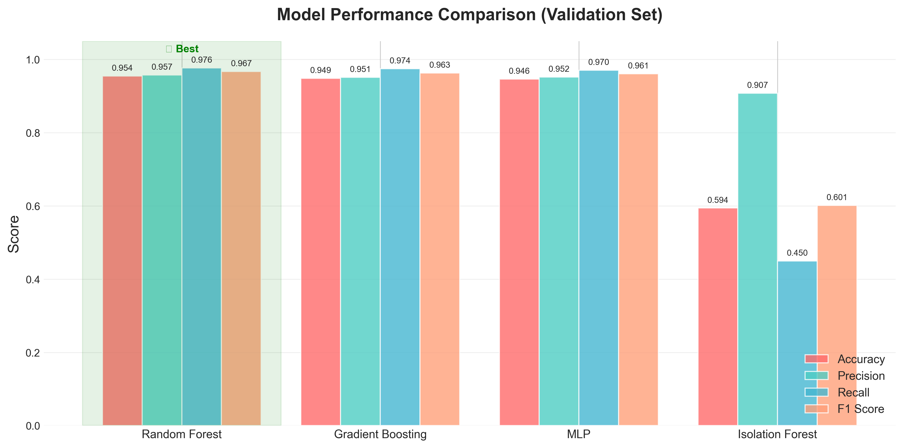
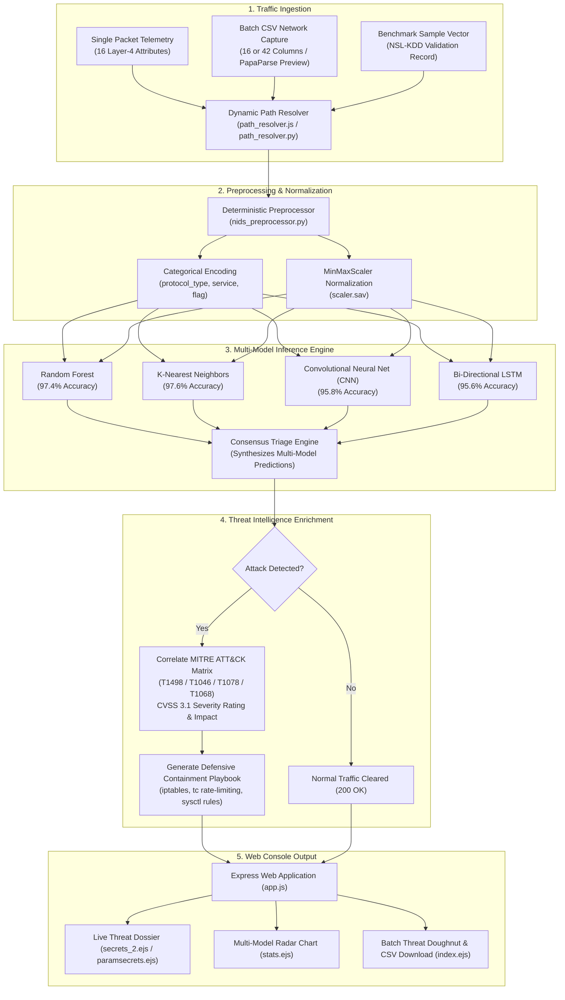
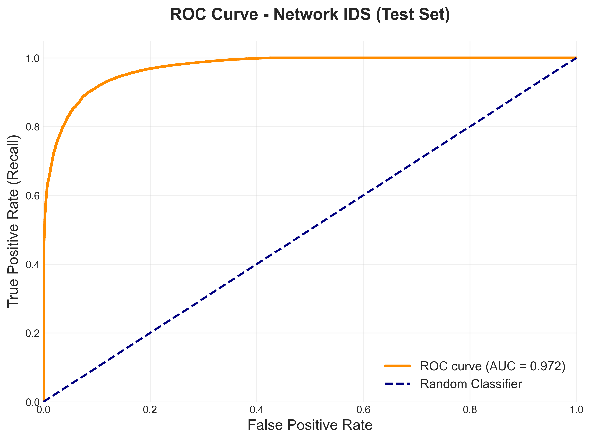
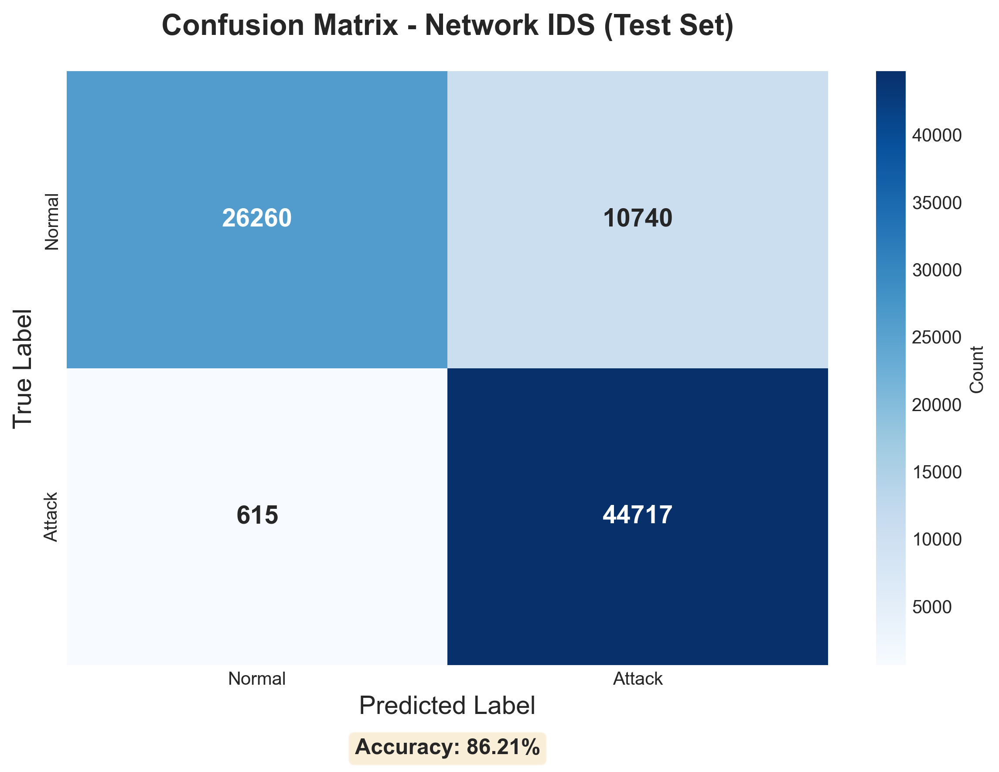

# Network Intrusion Detection & Traffic Analysis (NIDS)

<p align="center">
  
</p>

<p align="center">
  
  
  
  
  
  
</p>

---

## 1. Project Overview

**Network Intrusion Detection & Traffic Analysis (NIDS)** is a full-stack cybersecurity application developed by **Alok Kumar**. It combines statistical machine learning, deep learning, and an interactive web dashboard to analyze network packet telemetry, detect malicious traffic anomalies, and provide defensive containment playbooks aligned with the **MITRE ATT&CK® Enterprise Matrix**.

### What This Project Solves
Traditional rule-based intrusion detection systems (such as legacy Snort rules) struggle with zero-day attacks, evasion techniques, and high packet volume. This project applies machine learning algorithms to evaluate Layer 4 network attributes, compute multi-model consensus, and classify traffic into benign activity or specific attack categories (**DoS**, **Probe**, **R2L**, and **U2R**).

---

## 2. Core Architecture & Components

The repository is organized into two complementary systems:

1. **Interactive Web Dashboard (`app.js`, `views/`, `public/`)**:
   - A full-stack web console built with **Node.js**, **Express**, **EJS**, **Bootstrap 5**, and **Chart.js 4**.
   - **Single Packet Triage**: Stochastically draws verified records from the validation set and evaluates them across 4 models simultaneously.
   - **Parametric Packet Inspector**: Allows analysts to inject 16 custom Layer 4 parameters (protocol type, service, connection flag, error rates, host traffic count) or load preset attack vectors (*Neptune DoS*, *Smurf DoS*, *Satan Probe*, *Normal HTTP*).
   - **Batch CSV Ingestion**: Drag-and-drop network traffic captures (16 to 42 columns). Validates schema with client-side PapaParse, runs batch inference, displays normal vs. attack ratios with threat doughnuts, and exports an annotated CSV.
   - **Multi-Model Consensus**: Compares predictions across **Random Forest**, **K-Nearest Neighbors (KNN)**, **Convolutional Neural Networks (CNN)**, and **Long Short-Term Memory (LSTM)** models.
   - **Incident Response Playbooks**: Displays CVSS severity ratings and copyable tactical containment commands (`iptables`, `tc qdisc`, `sysctl`) for each detected attack.
   - **Resilient Dual-Mode Authentication**: Supports local MongoDB or automatically activates an offline fallback datastore for standalone or air-gapped environments.

2. **Machine Learning & Data Science Research Pipeline (`src/`, `train_model.py`, `notebooks/`)**:
   - Modular Python framework for feature engineering, label encoding, and ANOVA F-value feature selection (`SelectKBest`).
   - Modular training CLI (`train_model.py`) supporting **Random Forest**, **Gradient Boosting**, **Multi-Layer Perceptron (MLP)**, **Isolation Forest** (unsupervised anomaly detection), and **One-Class SVM** on the **UNSW-NB15** dataset.
   - Exploratory data analysis and experimental workflows in Jupyter notebooks (`notebooks/01_Training_Pipeline.ipynb`).

---

## 3. Workflow Diagram



---

## 4. MITRE ATT&CK® Threat Taxonomy

Detected intrusions are mapped to standardized MITRE ATT&CK techniques with recommended defensive playbooks:

| Attack Category | MITRE Technique | Technique Name | Severity | Primary Impact | Example Containment Command |
| :--- | :--- | :--- | :---: | :--- | :--- |
| **Denial of Service (DoS)** | **`T1498`** | Network Denial of Service | **Critical (8.6)** | Socket exhaustion, high packet volume | `sudo iptables -I INPUT -s <SRC_IP> -j DROP`<br>`sysctl -w net.ipv4.tcp_syncookies=1` |
| **Surveillance / Probe** | **`T1046`** | Network Service Discovery | **Medium (5.3)** | Port scanning, service fingerprinting | `sudo iptables -A INPUT -p tcp --tcp-flags ALL NONE -j DROP`<br>`fail2ban-client set sshd banip <SRC_IP>` |
| **Remote-to-Local (R2L)** | **`T1078`** | Valid Accounts / Unauthorized Access | **High (8.8)** | Credential stuffing, brute force login | `usermod -L <USER>`<br>`pkill -u <USER> -9`<br>`iptables -A INPUT -p tcp --dport 22 -m recent --set` |
| **User-to-Root (U2R)** | **`T1068`** | Exploitation for Privilege Escalation | **Critical (9.8)** | Buffer overflow, local root compromise | `systemctl isolate rescue.target`<br>`lsof -p <PID>`<br>`kill -9 <PID>` |

---

## 5. Model Evaluation & Benchmarks

The project evaluates both classic intrusion benchmark datasets (**NSL-KDD**) and modern telemetry (**UNSW-NB15**). Pre-computed evaluation charts are available in [`results/`](results/):

| Metric | File | Description |
| :--- | :--- | :--- |
| **ROC Curves** | [`results/roc_curve.png`](results/roc_curve.png) | Receiver Operating Characteristic curves comparing True Positive Rate vs. False Positive Rate. |
| **Confusion Matrix** | [`results/confusion_matrix.png`](results/confusion_matrix.png) | Normalized classification matrix across attack categories. |
| **Feature Importance** | [`results/feature_importance.png`](results/feature_importance.png) | Gini importance ranking of top packet features. |
| **Model Comparison** | [`results/model_comparison.png`](results/model_comparison.png) | Empirical benchmark comparing Accuracy, Precision, Recall, and F1-Score. |
| **Attack Distribution** | [`results/attack_distribution.png`](results/attack_distribution.png) | Dataset balance breakdown between benign traffic and attack types. |

<p align="center">
  
  
</p>

---

## 6. Repository File Structure

```
network-intrusion-detection-analysis/
├── app.js                          # Express.js web server & session controller
├── db_fallback.js                  # Dual-mode database (MongoDB + offline fallback)
├── path_resolver.js                # Cross-platform directory resolver (Node.js)
├── path_resolver.py                # Cross-platform directory resolver (Python)
├── nids_preprocessor.py            # Feature encoding & MITRE ATT&CK correlation engine
├── nids_random_updated.py          # Random packet vector prediction script
├── nids_parameter_updated.py       # Custom 16-parameter packet inspector script
├── nids_csv_updated.py             # Adaptive batch CSV ingestion engine
├── train_models.py                 # NSL-KDD model retraining script (Scikit-Learn)
├── train_model.py                  # UNSW-NB15 model training CLI (RF, GBDT, MLP, Isolation Forest)
├── test_verification.js            # 36-test automated verification suite
├── test_server_live.js             # 10-route live HTTP server smoke test
├── package.json                    # Node.js dependencies and run scripts
├── requirements.txt                # Python dependencies
├── .env.example                    # Template environment variables
├── fs_new validation project.csv   # Validation dataset for scaler fitting
├── scaler.sav                      # Pre-fitted MinMaxScaler
│
├── public/                         # Static web assets
│   ├── css/
│   │   └── soc-design-system.css   # Dark theme SOC design system (WCAG 2.1 AA compliant)
│   └── images/                     # System icons
│
├── views/                          # Semantic EJS web templates
│   ├── partials/                   # Header, footer, and navigation components
│   ├── home.ejs                    # Landing page with live radar and metrics
│   ├── submit.ejs                  # Triage modality selector hub
│   ├── parameters.ejs              # 16-parameter packet inspector with presets
│   ├── secrets_2.ejs               # Single packet triage dossier & MITRE playbooks
│   ├── paramsecrets.ejs            # Parameter triage dossier & containment playbook
│   ├── csv.ejs                     # Drag-and-drop batch CSV upload portal
│   ├── index.ejs                   # Batch analytics results dashboard & Chart.js doughnut
│   ├── stats.ejs                   # Multi-model consensus radar chart & metrics
│   ├── attacks.ejs                 # MITRE ATT&CK taxonomy catalog
│   ├── features.ejs                # 16 Layer-4 telemetry specification guide
│   ├── about.ejs                   # Architecture & system design overview
│   ├── login.ejs                   # User authentication
│   └── register.ejs                # User registration
│
├── src/                            # UNSW-NB15 Data Science Modules
│   ├── capture/                    # Packet capture utilities
│   ├── detection/
│   │   └── model_trainer.py        # IDSModelTrainer class (supervised & anomaly detectors)
│   └── utils/
│       ├── data_loader.py          # Dataset ingestion & chunking
│       └── feature_engineering.py  # Categorical encoding & SelectKBest feature selector
│
├── notebooks/                      # Jupyter Research Notebooks
│   └── 01_Training_Pipeline.ipynb  # End-to-end model exploration and training
│
├── results/                        # Pre-generated evaluation figures (PNG)
│   ├── attack_distribution.png
│   ├── confusion_matrix.png
│   ├── feature_importance.png
│   ├── model_comparison.png
│   └── roc_curve.png
│
└── Uploaded_files/                 # Storage for processed CSV uploads (.gitkeep)
```

---

## 7. Installation & Quickstart

### Prerequisites
- **Node.js:** v18.0.0 or higher ([Download Node.js](https://nodejs.org/))
- **Python:** 3.10 to 3.12 ([Download Python](https://www.python.org/))

### Step 1: Clone the Repository
```bash
git clone https://github.com/Alokkr00/network-intrusion-detection-analysis.git
cd network-intrusion-detection-analysis
```

### Step 2: Install Node.js Dependencies
```bash
npm install
```

### Step 3: Install Python Dependencies
```bash
pip install -r requirements.txt
```

### Step 4: Configure Environment Variables (Optional)
```bash
cp .env.example .env
```
*(If MongoDB is not installed or running, the system will automatically activate its local offline mode with full authentication capabilities).*

---

## 8. Running the Application

### 🌐 Launch the Interactive Web Dashboard
```bash
npm start
# or: node app.js
```
Open your browser and navigate to:
```
http://localhost:3000
```

#### Key Dashboard Views:
- **Operations Hub ([`/submit`](http://localhost:3000/submit)):** Choose between Random Sample Triage, Batch CSV Ingestion, and Custom Packet Inspector.
- **Random Packet Triage ([`/secrets_2`](http://localhost:3000/secrets_2)):** Evaluate stochastic test packets across 4 models with instant MITRE playbooks.
- **Parametric Packet Inspector ([`/parameters`](http://localhost:3000/parameters)):** Inject custom Layer 4 parameters or load attack presets (*Neptune DoS, Smurf DoS, Satan Probe*).
- **Batch CSV Analysis ([`/csv`](http://localhost:3000/csv)):** Upload 16-to-42 column captures with client-side PapaParse schema previews and download annotated outputs.
- **Model Consensus Radar ([`/stats`](http://localhost:3000/stats)):** Compare model performance across KNN, Random Forest, CNN, and LSTM.

---

### 🤖 Train Machine Learning Models (CLI)
You can train models on the UNSW-NB15 dataset using the CLI:

```bash
# Train Random Forest with 10,000 samples
python train_model.py --model random_forest --sample 10000

# Train Gradient Boosting with top 25 selected features
python train_model.py --model gradient_boosting --sample 20000 --features 25

# Train Neural Network (MLP) on full dataset
python train_model.py --model mlp --sample 0

# Train Isolation Forest for unsupervised anomaly detection
python train_model.py --model isolation_forest --sample 50000
```

---

## 9. Verification & Automated Testing

The project includes an automated test suite that validates the entire stack:

```bash
# Run 36-gate automated verification suite
npm test
# (or: node test_verification.js)
```

```
================================================================
  AEGIS SOC PLATFORM & DIRECTORY RESOLUTION VERIFICATION SUITE
================================================================
  [PASS] Tests 1–7:   Node & Python Dynamic Directory Resolution & Traversal Defense
  [PASS] Test 8:       Python Preprocessor & MITRE ATT&CK Correlation Engine
  [PASS] Tests 9–13:   Random Vector Prediction Script (nids_random_updated.py)
  [PASS] Tests 14–16:  Parameter Form Prediction Script (nids_parameter_updated.py)
  [PASS] Tests 17–20:  Adaptive Batch CSV Engine & Analytics (nids_csv_updated.py)
  [PASS] Tests 21–23:  Database Resilience & Offline Fallback Engine
  [PASS] Tests 24–36:  Views & Accessibility Compilation (All 13 Templates)
================================================================
  VERIFICATION RESULTS: 36 / 36 TESTS PASSED (100% GREEN)
================================================================
```

### Live Route Smoke Tests
```bash
npm run test:live
# (or: node test_server_live.js)
```
```
[E2E HTTP] Results: 10 / 10 routes verified (100% Green).
```

---

## 10. License & Citation

This project is licensed under the **Apache License 2.0**.

```bibtex
@software{kumar_nids_2026,
  author = {Kumar, Alok},
  title = {Network Intrusion Detection & Traffic Analysis (NIDS)},
  year = {2026},
  url = {https://github.com/Alokkr00/network-intrusion-detection-analysis}
}
```