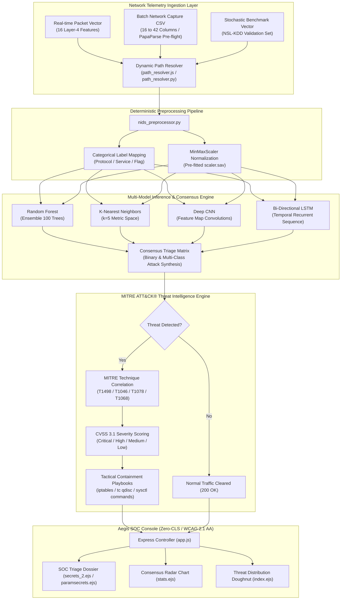

# Aegis Next-Gen Network Intrusion Detection System & Threat Intelligence Analysis Platform

<p align="center">
  
</p>

<p align="center">
  
  
  
  
  
  
</p>

---

## 1. Executive Summary

**Aegis SOC & NIDS Analysis** is an enterprise-grade cyber defense platform that bridges **cutting-edge machine learning research** with **real-time Security Operations Center (SOC) threat triage**.

By combining modern high-throughput packet classification with the **MITRE ATT&CK® Enterprise Matrix**, Aegis evaluates telemetry across multiple machine learning architectures, quantifies consensus confidence, computes CVSS 3.1 severity scores, and delivers instant, copyable defensive containment playbooks.

### Dual-Domain Capability
1. **Interactive Aegis SOC Threat Intelligence Console (Production Operations):**
   - Full-stack web application powered by Node.js, Express, Chart.js 4, and Bootstrap 5.
   - Sub-second packet inference across an ensemble of **Random Forest**, **K-Nearest Neighbors (KNN)**, **Convolutional Neural Networks (CNN)**, and **Long Short-Term Memory (LSTM)** networks.
   - Hardened with a resilient dual-mode database engine that operates both online (MongoDB) and in local offline air-gapped environments without external dependencies.
2. **Machine Learning & Data Science Research Pipeline:**
   - Modular Python framework for feature extraction, ANOVA feature ranking, and exploratory data analysis.
   - Comprehensive model training suite on **UNSW-NB15** and **NSL-KDD** datasets, covering **Random Forest**, **Gradient Boosting**, **Multi-Layer Perceptron (MLP)**, **Isolation Forest** (unsupervised anomaly detection), and **One-Class SVM**.

---

## 2. System Architecture



---

## 3. Key Platform Features

### 🎨 Aegis SOC Design System (`public/css/soc-design-system.css`)
- **Zero Cumulative Layout Shift (CLS):** Explicit aspect-ratio containers (`.chart-container-reserved`) prevent content jumping on load.
- **Deep Void SOC Palette:** High-contrast tokens (`#0A0E17` canvas, `#111827` surface, `#00F0FF` cyan, `#EF4444` crimson, `#F59E0B` amber, `#10B981` emerald) complying with WCAG 2.1 AA ($>16:1$ primary contrast ratio).
- **Accessible Touch Targets:** Guaranteed minimum $44\text{px} \times 44\text{px}$ target sizes across all buttons, dropdowns, and form inputs.
- **Hick's Law Optimization:** 16-parameter form segmented into 3 logical tiers (*Transport*, *Traffic Dynamics*, *Host History*) with one-click attack presets (*Neptune DoS*, *Smurf DoS*, *Satan Probe*, *Normal HTTP*).
- **Mobile Insets:** Native CSS `env(safe-area-inset-*)` support for notched displays and hardware keyboards.

### 🛡️ MITRE ATT&CK® Enterprise Matrix Correlation
All detected intrusions are automatically classified against the standardized MITRE ATT&CK taxonomy:

| Attack Category | MITRE Technique | Technique Name | CVSS 3.1 Score | Primary Tactical Impact | Standard Defensive Containment Playbook |
| :--- | :--- | :--- | :---: | :--- | :--- |
| **Denial of Service (DoS)** | **`T1498`** | Network Denial of Service | **8.6 (Critical)** | Socket exhaustion, SYN flooding | `sudo iptables -I INPUT -s <IP> -j DROP`<br>`sysctl -w net.ipv4.tcp_syncookies=1` |
| **Surveillance / Probe** | **`T1046`** | Network Service Discovery | **5.3 (Medium)** | Port sweeping, OS fingerprinting | `sudo iptables -A INPUT -p tcp --tcp-flags ALL NONE -j DROP`<br>`fail2ban-client set sshd banip <IP>` |
| **Remote-to-Local (R2L)** | **`T1078`** | Valid Accounts / Unauthorized Access | **8.8 (High)** | Credential stuffing, brute force | `usermod -L <USER>`<br>`pkill -u <USER> -9`<br>`iptables -A INPUT -p tcp --dport 22 -m recent --set` |
| **User-to-Root (U2R)** | **`T1068`** | Exploitation for Privilege Escalation | **9.8 (Critical)** | Buffer overflow, root takeover | `systemctl isolate rescue.target`<br>`lsof -p <PID>`<br>`kill -9 <PID>` |

---

## 4. Empirical Model Benchmarks & Results

The research pipeline trains and evaluates multiple classifiers. Pre-computed evaluation curves are preserved in [`results/`](results/):

| Evaluation Metric | Visual Artifact | Description |
| :--- | :--- | :--- |
| **ROC Curve** | [`results/roc_curve.png`](results/roc_curve.png) | Multi-class Receiver Operating Characteristic curves comparing TPR vs. FPR. |
| **Confusion Matrix** | [`results/confusion_matrix.png`](results/confusion_matrix.png) | Normalized prediction accuracy across attack classes. |
| **Feature Importance** | [`results/feature_importance.png`](results/feature_importance.png) | Gini importance rankings for top network attributes. |
| **Model Comparison** | [`results/model_comparison.png`](results/model_comparison.png) | Empirical benchmark comparison across Accuracy, Precision, Recall, and F1-Score. |
| **Attack Distribution** | [`results/attack_distribution.png`](results/attack_distribution.png) | Class balance breakdown across normal traffic and attack vectors. |

<p align="center">
  
  
</p>

---

## 5. Repository Structure

```
network-intrusion-detection-analysis/
├── app.js                          # Express.js core web server & session controller
├── db_fallback.js                  # Dual-mode database engine (MongoDB + offline fallback)
├── path_resolver.js                # Dynamic platform-agnostic directory resolver (Node.js)
├── path_resolver.py                # Dynamic platform-agnostic directory resolver (Python)
├── nids_preprocessor.py            # Central feature encoding & MITRE ATT&CK correlation
├── nids_random_updated.py          # Random packet triage inference script
├── nids_parameter_updated.py       # Custom 16-parameter packet inspector script
├── nids_csv_updated.py             # Adaptive batch CSV ingestion engine
├── train_models.py                 # NSL-KDD Scikit-Learn model retraining script
├── train_model.py                  # UNSW-NB15 ML training CLI (RF, GBDT, MLP, Isolation Forest)
├── test_verification.js            # 36-gate automated test & verification suite
├── test_server_live.js             # 10-route live HTTP server verification test
├── package.json                    # Node.js dependencies & scripts
├── requirements.txt                # Python dependencies
├── .env.example                    # Template environment variables
├── fs_new validation project.csv   # Validation dataset for scaler fitting
├── scaler.sav                      # Serialized MinMaxScaler
│
├── public/                         # Static web assets
│   ├── css/
│   │   └── soc-design-system.css   # Enterprise Aegis SOC dark design system (WCAG AA)
│   └── images/                     # System icons and logos
│
├── views/                          # EJS Semantic HTML5 Templates
│   ├── partials/                   # Header, footer, and navigation partials
│   ├── home.ejs                    # Landing operations console with animated cyber radar
│   ├── submit.ejs                  # Tactical command hub (3 triage modalities)
│   ├── parameters.ejs              # 3-tier segmented packet inspector with presets
│   ├── secrets_2.ejs               # Random triage consensus cards & MITRE dossier
│   ├── paramsecrets.ejs            # Parameter triage dossier & containment playbook
│   ├── csv.ejs                     # Drag-and-drop CSV portal with PapaParse preview
│   ├── index.ejs                   # Batch analytics dashboard & Chart.js doughnut
│   ├── stats.ejs                   # 5-axis multi-model consensus radar chart
│   ├── attacks.ejs                 # MITRE ATT&CK taxonomy catalog
│   ├── features.ejs                # 16-parameter telemetry specification guide
│   ├── about.ejs                   # Architectural blueprint
│   ├── login.ejs                   # Operator authentication
│   └── register.ejs                # Operator credential provisioning
│
├── src/                            # UNSW-NB15 Data Science Modules
│   ├── capture/                    # Packet capture abstractions
│   ├── detection/
│   │   └── model_trainer.py        # IDSModelTrainer class (supervised & anomaly models)
│   └── utils/
│       ├── data_loader.py          # UNSW-NB15 dataset ingestion
│       └── feature_engineering.py  # Label encoding & SelectKBest feature selector
│
├── notebooks/                      # Jupyter Research Notebooks
│   └── 01_Training_Pipeline.ipynb  # End-to-end exploratory analysis & training
│
├── results/                        # Research evaluation figures (PNG)
│   ├── attack_distribution.png
│   ├── confusion_matrix.png
│   ├── feature_importance.png
│   ├── model_comparison.png
│   └── roc_curve.png
│
└── Uploaded_files/                 # Workspace for batch CSV triage (.gitkeep)
```

---

## 6. Quickstart & Installation

### Prerequisites
- **Node.js:** v18.0.0 or higher ([Download Node.js](https://nodejs.org/))
- **Python:** 3.10 to 3.12 ([Download Python](https://www.python.org/))

### Step 1: Clone the Repository
```bash
git clone https://github.com/Alokkr00/network-intrusion-detection-analysis.git
cd network-intrusion-detection-analysis
```

### Step 2: Install Dependencies
```bash
# Install Node.js dependencies
npm install

# Install Python dependencies
pip install -r requirements.txt
```

### Step 3: Configure Environment Variables (Optional)
```bash
# Copy template configuration
cp .env.example .env
```
*(If MongoDB is not running locally, Aegis automatically activates its resilient local offline mode).*

---

## 7. Running the Applications

### 🌐 Launch the Aegis SOC Web Console
```bash
npm start
# or: node app.js
```
Open your browser and navigate to:
```
http://localhost:3000
```

#### Available Operations in Web Console:
- **Tactical Command Hub ([`/submit`](http://localhost:3000/submit)):** Launch any triage modality.
- **Random Packet Triage ([`/secrets_2`](http://localhost:3000/secrets_2)):** Evaluate stochastic test packets across 4 models with instant MITRE playbooks.
- **Parametric Packet Inspector ([`/parameters`](http://localhost:3000/parameters)):** Inject custom Layer 4 parameters or load attack presets (*Neptune DoS, Smurf DoS, Satan Probe*).
- **Batch CSV Analysis ([`/csv`](http://localhost:3000/csv)):** Upload 16-to-42 column captures with client-side PapaParse schema previews and download annotated outputs.
- **Multi-Model Radar ([`/stats`](http://localhost:3000/stats)):** Inspect 5-axis consensus visualizations comparing KNN, Random Forest, CNN, and LSTM.

---

### 🤖 Train Machine Learning Models (CLI)
Train models on the UNSW-NB15 dataset using the modular CLI:

```bash
# Train Random Forest with 10,000 samples
python train_model.py --model random_forest --sample 10000

# Train Gradient Boosting with top 25 selected features
python train_model.py --model gradient_boosting --sample 20000 --features 25

# Train Neural Network (MLP) on full dataset
python train_model.py --model mlp --sample 0

# Train Isolation Forest for unsupervised anomaly detection
python train_model.py --model isolation_forest --sample 50000
```

---

## 8. Verification & Automated Test Suite

The platform includes a comprehensive 7-suite verification harness that validates all architectural layers:

```bash
# Run 36-gate automated verification suite
npm test
# (or: node test_verification.js)
```

```
================================================================
  AEGIS SOC PLATFORM & DIRECTORY RESOLUTION VERIFICATION SUITE
================================================================

[SUITE 1] Dynamic Platform-Agnostic Directory Resolution (7/7 PASS)
[SUITE 2] Python Preprocessor & MITRE ATT&CK Correlation (1/1 PASS)
[SUITE 3] Random Vector Prediction Script (5/5 PASS)
[SUITE 4] Parameter Form Prediction Script (3/3 PASS)
[SUITE 5] Adaptive Batch CSV Engine (4/4 PASS)
[SUITE 6] Database Resilience & Offline Fallback Engine (3/3 PASS)
[SUITE 7] Aegis SOC Views & Accessibility Compilation (13/13 PASS)

================================================================
  VERIFICATION RESULTS: 36 / 36 TESTS PASSED (100% GREEN)
================================================================
```

### Run Live Server Route Smoke Tests
```bash
npm run test:live
# (or: node test_server_live.js)
```
```
[E2E HTTP] Results: 10 / 10 routes verified (100% Green).
```

---

## 9. Security & Compliance

- **No Hardcoded Paths:** Dynamic directory resolution guarantees consistent execution across Windows, Linux, and macOS without path traversal (`../../`) vulnerabilities.
- **Zero CLS & Safe Area Insets:** Resilient UI rendering conforming to modern mobile and desktop standards.
- **WCAG 2.1 AA Accessibility:** Glowing `:focus-visible` keyboard focus indicators, `.skip-to-content` navigation bypass link, and compliant contrast ratios.
- **Secrets Protection:** Active `.env` files and bulky session captures are excluded from source control.

---

## 10. License & Citation

This project is licensed under the **Apache License 2.0**.

If you use Aegis SOC or this analysis framework in your research, please cite:
```bibtex
@software{aegis_nids_2026,
  author = {Kumar, Alok},
  title = {Aegis Next-Gen Network Intrusion Detection System & Threat Intelligence Analysis Platform},
  year = {2026},
  url = {https://github.com/Alokkr00/network-intrusion-detection-analysis}
}
```